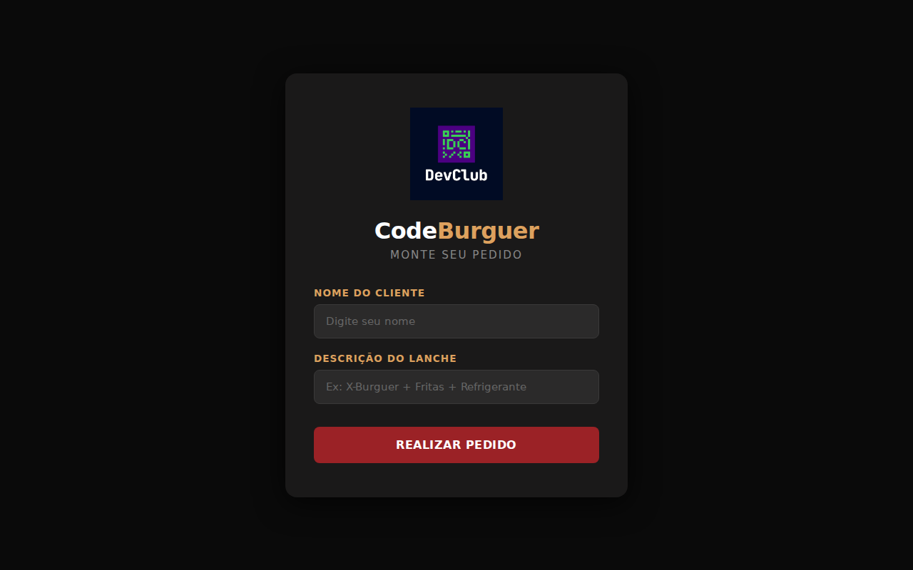
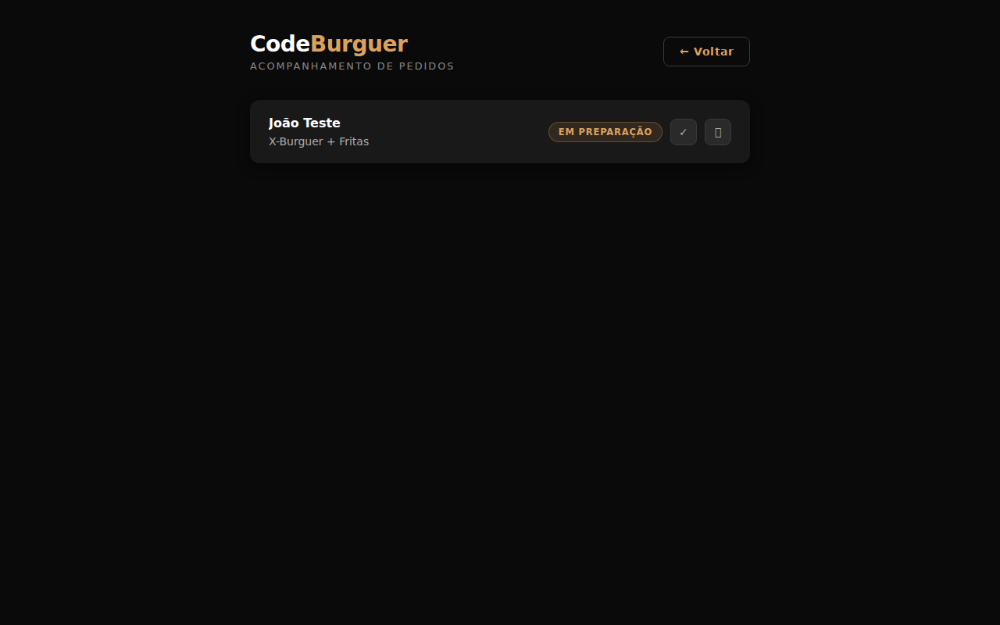

# CodeBurger | DevClub

Sistema de gerenciamento de pedidos de uma hamburgueria, desenvolvido com Node.js + React durante o curso da DevClub.

**Deploy:** https://code-burger-jb.vercel.app

## Tecnologias

**Backend (local)**
- Node.js + Express 5
- Sequelize ORM + PostgreSQL
- UUID para identificadores de pedidos
- CORS + nodemon

**Backend (produção — Vercel)**
- Vercel Serverless Functions (`api/`)
- Neon Serverless PostgreSQL (via Vercel Marketplace)

**Frontend**
- React 19 + Vite
- React Router DOM
- Axios
- Design responsivo (mobile-first, breakpoint 480px)

## Estrutura do projeto

```
code-burger-jb/
├── api/                        # Vercel Serverless Functions (produção)
│   ├── _lib/
│   │   └── observe.js          # withResponseTime + handleDbError (compartilhado)
│   ├── orders/
│   │   └── [id].js             # PUT /api/orders/:id, DELETE /api/orders/:id
│   ├── health.js               # GET /api/health
│   ├── menu.js                 # GET /api/menu
│   └── orders.js               # GET /api/orders, POST /api/orders
├── src/                        # Backend Express (desenvolvimento local)
│   ├── config/database.js
│   ├── data/
│   │   └── menu.json           # Cardápio estático (fonte única para local e produção)
│   ├── middleware/
│   │   ├── logger.js           # Log estruturado de requisições e erros
│   │   └── responseTime.js     # Header X-Response-Time
│   ├── models/
│   ├── routes.js
│   └── server.js               # Porta 3001
├── frontend/                   # React + Vite (porta 5173)
│   ├── public/favicon.png
│   └── src/pages/
│       ├── Home/               # Formulário de novo pedido com cardápio dinâmico
│       └── Orders/             # Listagem e acompanhamento de pedidos
└── vercel.json                 # Configuração de build e roteamento
```

## Pré-requisitos

- Node.js 18+
- PostgreSQL rodando localmente

## Configuração local

### Banco de dados

Crie o banco antes de subir o servidor:

```sql
CREATE DATABASE codeburger_jb;
```

Por padrão o backend usa as variáveis abaixo. Crie um `.env` na raiz para sobrescrever:

```env
DB_HOST=localhost
DB_PORT=5432
DB_USER=postgres
DB_PASS=postgres
DB_NAME=codeburger_jb
```

O Sequelize cria a tabela `orders` automaticamente na primeira inicialização (`sequelize.sync()`).

## Rodando o projeto

### Backend (porta 3001)

```bash
# Na raiz do projeto
npm install
npm run dev
```

### Frontend (porta 5173)

```bash
cd frontend
npm install
npm run dev
```

O Vite já tem proxy configurado: chamadas para `/api/*` são redirecionadas automaticamente para `localhost:3001`.

Acesse **http://localhost:5173**

## Deploy (Vercel)

O projeto está publicado em produção na Vercel com Neon como banco de dados serverless.

**URL:** https://code-burger-jb.vercel.app

A Vercel utiliza os arquivos em `api/` como Serverless Functions e o conteúdo de `frontend/dist` como site estático. O banco é provisionado automaticamente via integração Neon no Vercel Marketplace.

### Roteamento

O `vercel.json` usa lookahead negativo no rewrite do SPA para garantir que requisições `/api/*` nunca sejam interceptadas pelo catch-all de rotas estáticas:

```json
{ "source": "/((?!api/).*)", "destination": "/index.html" }
```

## API

| Método | Rota | Descrição |
|--------|------|-----------|
| `GET` | `/api/health` | Health check — retorna `{ status, version }` |
| `GET` | `/api/menu` | Lista os itens do cardápio |
| `GET` | `/api/orders` | Lista todos os pedidos |
| `POST` | `/api/orders` | Cria um novo pedido |
| `PUT` | `/api/orders/:id` | Atualiza o status de um pedido |
| `DELETE` | `/api/orders/:id` | Remove um pedido |

### Fluxo de status

```
Em preparação → Pronto → Entregue
```

### Exemplos

**Health check**
```bash
curl https://code-burger-jb.vercel.app/api/health
# {"status":"ok","version":"1.0.0"}
```

**Criar pedido**
```bash
curl -X POST https://code-burger-jb.vercel.app/api/orders \
  -H "Content-Type: application/json" \
  -d '{"clientName": "João", "order": "Monster"}'
```

**Avançar status**
```bash
curl -X PUT https://code-burger-jb.vercel.app/api/orders/<id> \
  -H "Content-Type: application/json" \
  -d '{"status": "Pronto"}'
```

## Observabilidade

### Logs estruturados

O servidor Express emite uma linha de log por requisição no formato:

```
[2026-06-11T14:32:01.123Z] INFO GET /orders 200 12ms
[2026-06-11T14:32:02.456Z] WARN GET /orders/abc 404 3ms
[2026-06-11T14:32:03.789Z] ERROR POST /orders 500 8ms
```

As Vercel Functions (`api/`) utilizam `console.log` com o mesmo padrão ISO 8601, visíveis no painel de logs da Vercel.

### Header X-Response-Time

Todas as respostas incluem o header `X-Response-Time` com a duração em milissegundos medida via `process.hrtime.bigint()`:

```
X-Response-Time: 4.72ms
```

### Health check

`GET /api/health` retorna o status da aplicação e a versão do `package.json`. Pode ser usado por uptime monitors externos para verificar se o serviço está no ar.

### Erros de conexão com o banco

Erros de rede (ECONNREFUSED, ETIMEDOUT, ENOTFOUND, etc.) retornam **503 Service Unavailable** com mensagem amigável, em vez de expor stack traces ao cliente.

## Telas

| Home | Orders |
|------|--------|
|  |  |

**Home** — cliente escolhe o hambúrguer no menu dinâmico (carregado via `GET /api/menu`), preenche o nome e submete o pedido.

**Orders** — lista todos os pedidos vindos do banco em tempo real. Exibe "Nenhum pedido encontrado." quando a lista está vazia. Cada card permite avançar o status ou deletar o pedido. Layout responsivo: em mobile os cards empilham verticalmente.
